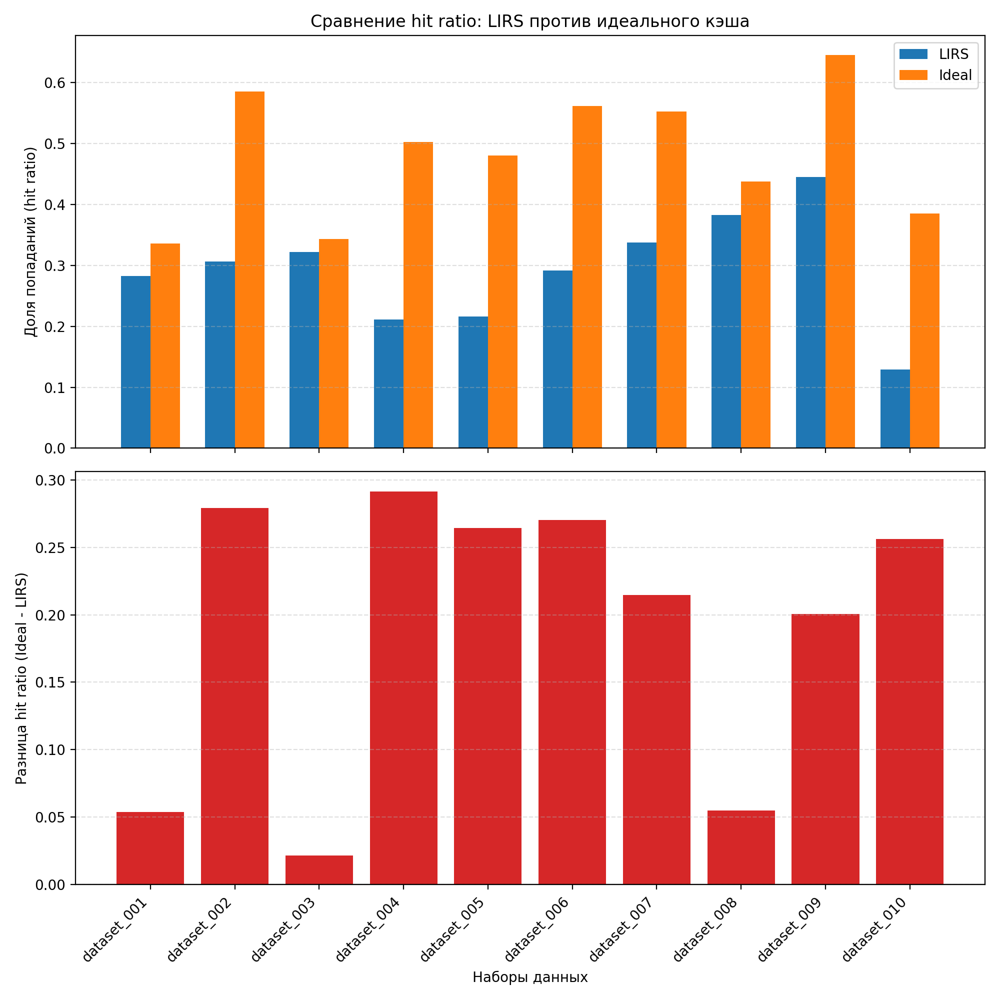

# Cache Task

Реализация трёх алгоритмов управления кэшем (LRU, LIRS и «идеальный») в рамках первого задания курса MIPT ILab по C++. Каждый алгоритм снабжён модульными тестами и простой CLI-утилитой для ручных экспериментов и прогонки наборов запросов.

## Реализованные алгоритмы

- **LRU (Least Recently Used)** — классический стековый алгоритм, хранящий в кэше последние использованные страницы.
- **LIRS (Low Inter-reference Recency Set)** — более продвинутая стратегия, разделяющая страницы на LIR/HIR и обеспечивающая лучшую адаптацию к паттернам доступа.
- **Ideal cache** — алгоритм для эталонных значений и генерации ответов на больших тестах.

## Требования

- Компилятор с поддержкой C++17 (GCC, Clang или MSVC).
- CMake 3.15+.
- Доступ в интернет при первой сборке (скачивается GoogleTest).
- Python 3.8+ (только если нужно регенерировать тесты для идеального кэша).

## Сборка

```bash
cmake -S . -B build
cmake --build build
```

По умолчанию собираются бинарники тестов и CLI для каждого алгоритма.

## Тестирование

Запустить все тесты целиком:

```bash
cmake --build build --target test
```

или напрямую:

- `build/tests/LRU_tests`
- `build/tests/LIRS_tests`
- `build/tests/ideal_tests`
- `build/tests/ideal_big_tests` — прогон уже сгенерированных big-тестов для идеального кэша.

## CLI и формат ввода

Каждая утилита читает со стандартного ввода размер кэша, количество запросов и последовательность ключей, после чего выводит число cache-hit'ов.

```text
<cache_size>
<requests_count>
<key_1> <key_2> ... <key_n>
```

Команды запуска:

- `build/cli/LRU.out`
- `build/cli/LIRS.out`
- `build/cli/ideal.out`

Пример:

```bash
printf "2\n5\n1 2 1 3 1\n" | build/cli/LRU.out
```

## Структура проекта

```
.
├── CMakeLists.txt
├── LIRS/         # LIRS cache + тесты и CLI
├── LRU/          # LRU cache, общая обвязка и CLI
├── ideal/        # Алгоритм идеального кэша, big-tests и генераторы
├── experiments/  # Сравнение алгоритмов LIRS vs ideal
└── README.md
```

## Генерация тестов

В каталоге `ideal/` лежат скрипты для построения наборов тестов:

- `python ideal/gen_tests.py` — пересоздаёт unit-тесты для GoogleTest.
- `python ideal/gen_big_tests.py` — генерирует файлы `.dat` и `.sol` в `ideal/big_tests/` для нагрузочного тестирования.

Перед запуском убедитесь, что у вас установлен Python 3 и зависимости из стандартной библиотеки достаточно (дополнительные пакеты не требуются).

## Эксперимент LIRS vs Ideal

В каталоге `experiments/lirs_vs_ideal/` находятся все вспомогательные инструменты:

- `datasets/` — входные `.dat` с тестовыми паттернами.
- `results_lirs/`, `results_ideal/` — CSV-выгрузки с количеством попаданий и hit ratio для каждого алгоритма.
- `run_experiment.cc` → бинарник `lirs_vs_ideal_benchmark`, запускаемый через CMake.
- `generate_datasets.py` — генератор случайных сценариев.
- `plot_results.py` — построение графиков (по умолчанию `lirs_vs_ideal_comparison.png`).

Итоги примерного прогона на 10 случайных наборах запросов (см. `datasets/dataset_*.dat` и `lirs_vs_ideal_comparison.png`):

- Средний hit ratio LIRS: ~29% (min 13%, max 44%).
- Средний hit ratio идеального кэша: ~48% (min 34%, max 65%).
- Разница в пользу идеального кэша варьируется от 5 до 30 p.p., ярче всего проявляясь на наборах со «сложными» паттернами доступа (например, `dataset_002`, `dataset_004`, `dataset_010`).


